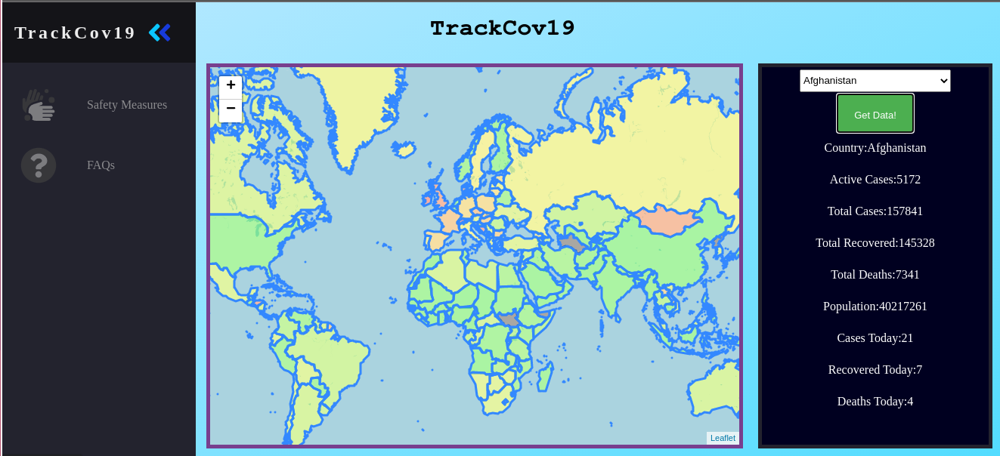

# TrackCov19
A Webpage which displays various information about Covid-19.
 
 

# Setting up
1. Star this repository :heart: (optional)
2. Clone this repository  
3. Create a virtual environment (optional)
4. Install dependencies `pip install -r requirements.txt`
5. Start flask server `python main.py`
